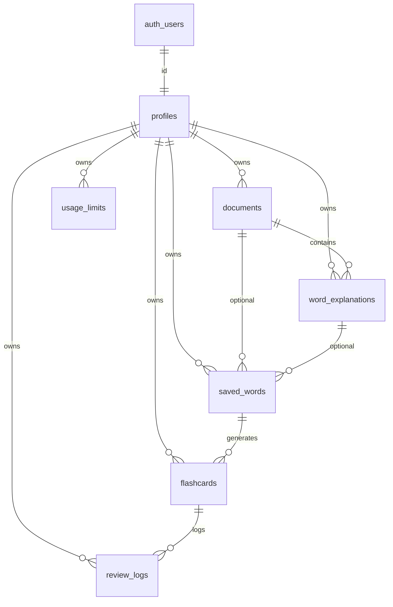

# ReadWays Supabase Backend

PostgreSQL schema, RLS policies, and TypeScript types for the ReadWays MVP.

## Structure

```
supabase/
├── config.toml              # Local CLI configuration
├── migrations/
│   ├── 20250520120000_extensions_and_functions.sql
│   ├── 20250520120001_init_schema.sql
│   └── 20250520120002_init_rls.sql
└── README.md

lib/supabase/
├── database.types.ts        # Database row/insert/update types
├── types.ts                 # Domain type aliases
├── schema.ts                # Enum constants (plan, status, rating)
├── env.ts                   # Environment helpers
├── client.ts                # Browser client factory
└── server.ts                # Server client factory
```

## Tables

| Table | Purpose |
|-------|---------|
| `profiles` | User profile (`auth.users` 1:1), plan tier |
| `documents` | Uploaded PDFs, extracted text, processing status |
| `word_explanations` | Word + sentence context (AI fields nullable for now) |
| `saved_words` | User vocabulary list with learning status |
| `flashcards` | Cards linked to saved words, spaced repetition schedule |
| `review_logs` | Append-only review history (hard/good/easy) |
| `usage_limits` | Per-day AI/upload counters |

## Relationships & cascades

- `profiles.id` → `auth.users.id` (**ON DELETE CASCADE**)
- `documents.user_id` → `profiles` (**CASCADE**)
- `word_explanations` → `profiles`, `documents` (**CASCADE**)
- `saved_words` → `profiles` (**CASCADE**); `document_id` / `word_explanation_id` (**SET NULL**)
- `flashcards` → `profiles`, `saved_words` (**CASCADE**)
- `review_logs` → `profiles`, `flashcards` (**CASCADE**)
- `usage_limits` → `profiles` (**CASCADE**)

## Triggers

- **`documents_set_updated_at`** — sets `updated_at` on every document update
- **`on_auth_user_created`** — inserts a `profiles` row when a user signs up

## Row Level Security

RLS is **enabled on every table**. Users may only read/write rows where `user_id` (or `profiles.id`) equals `auth.uid()`.

Insert policies on child tables also verify parent ownership (e.g. `document_id` belongs to the current user).

`review_logs` is **append-only** (select + insert only).

## Storage (PDF originals)

Migrations create a **private** bucket `documents` (not public). Paths:

`{userId}/{documentId}/{original-file-name}.pdf`

Row metadata: `documents.storage_path`, `documents.original_file_name`. Reading still uses `extracted_text`.

### Dashboard setup (if migrations did not create the bucket)

1. Supabase Dashboard → **Storage** → **New bucket**
2. Name: `documents`, **Public bucket**: off
3. Optional: file size limit **10 MB**, MIME type `application/pdf`
4. Run `supabase db push` so RLS policies on `storage.objects` are applied

### Local CLI

```bash
npx supabase db push
```

Signed URLs are not required for the reader; use them only if you add download/preview later.

## Apply migrations

### Local (Supabase CLI)

```bash
npm i -D supabase
npx supabase start
npx supabase db reset   # runs all migrations
```

### Remote project

```bash
npx supabase login
npx supabase link --project-ref <your-project-ref>
npx supabase db push
```

## Environment variables

Copy `.env.example` to `.env.local`:

```
NEXT_PUBLIC_SUPABASE_URL=https://<project>.supabase.co
NEXT_PUBLIC_SUPABASE_ANON_KEY=<anon-key>
```

The existing frontend does **not** require these until you wire auth or API routes.

## Regenerate TypeScript types

After changing migrations:

```bash
# Linked remote project
npm run supabase:types

# Local Supabase stack
npm run supabase:types:local
```

Types are written to `lib/supabase/database.types.ts`. Domain aliases live in `lib/supabase/types.ts`.

## Entity diagram (simplified)


